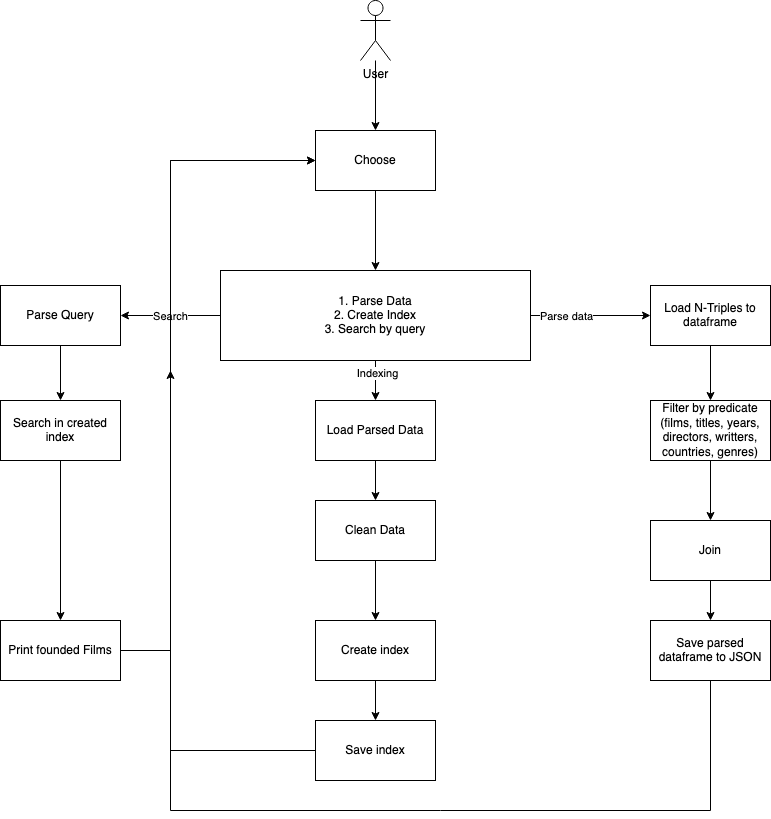
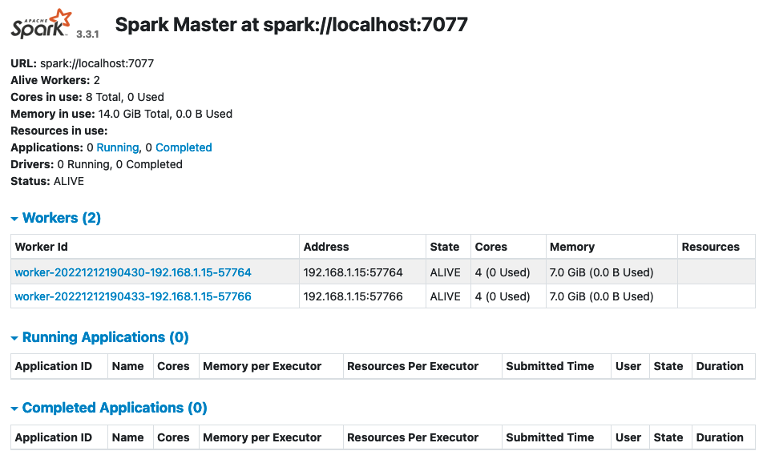
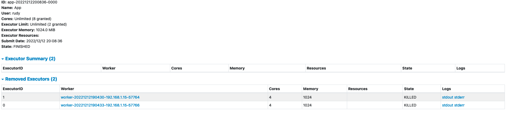

# Parsovanie title, alt a iných špecifických údajov entity Movie
**Predmet:** Vyhľadávanie informácií  
**Autor:** Martin Rudolf  
**Cvičiaci:** Ing. Igor Stupavský  
  
  Cieľom projketu je navrhnúť a implementovať systémové riešenie na parsovanie filmov a ich špecifikácií (názov, meno režiséra, meno scenáristu, rok vydania, krajina pôvodu, žaner) z freebase.  
  
  ## Technológie
  **Nxparser** na spracovanie RDF N-Triples - použité vo verzii 1 (branch: feature/verzia-1)  
  **Json** na sracovanie JSON súborov  
  **Apache Lucene** na ingexovanie a vyhladavanie - použité vo verzii 1, 2  
  **Apache Spark** na distribuované spracovanie a parsovanie - použité vo verzií 2
  
  ## Dáta
  [Head 1 000 000](https://vi2022.ui.sav.sk/lib/exe/fetch.php?media=freebase-head-1000000.zip)  
  [Head 10 000 000](https://vi2022.ui.sav.sk/lib/exe/fetch.php?media=freebase-head-10000000.zip)  
  [Head 100 000 000](https://vi2022.ui.sav.sk/lib/exe/fetch.php?media=freebase-head-100000000.zip)  
     Dáta na parsovanie sú vo formáte **RDF n-triples**. Pre správny chod programusúbor s dátami musí byť uložený v data/ntriples/<data-file>. 
   Ukážka:  
   ```
   <http://rdf.freebase.com/ns/g.11b6t1scwz>	<http://rdf.freebase.com/ns/type.object.type>	<http://rdf.freebase.com/ns/base.type_ontology.non_agent>	.
<http://rdf.freebase.com/ns/g.11b6t1scwz>	<http://rdf.freebase.com/ns/common.topic.topic_equivalent_webpage>	<http://en.wikipedia.org/wiki/index.html?curid=9997908>	.
<http://rdf.freebase.com/ns/g.11b6t1scwz>	<http://rdf.freebase.com/ns/type.object.type>	<http://rdf.freebase.com/ns/film.film>	.
<http://rdf.freebase.com/ns/g.11b6t1scwz>	<http://rdf.freebase.com/ns/type.object.key>	"/authority/imdb/title/tt0300059"	.
<http://rdf.freebase.com/ns/g.11b6t1scwz>	<http://rdf.freebase.com/ns/common.topic.notable_types>	<http://rdf.freebase.com/ns/m.0jsg2m>	.
<http://rdf.freebase.com/ns/g.11b6t1scwz>	<http://rdf.freebase.com/ns/film.film.initial_release_date>	"1973"^^<http://www.w3.org/2001/XMLSchema#gYear>	.
<http://rdf.freebase.com/ns/g.11b6t1scwz>	<http://rdf.freebase.com/ns/type.object.name>	"José María y María José: Una pareja de hoy"@en	.
<http://rdf.freebase.com/ns/g.11b6t1scwz>	<http://rdf.freebase.com/ns/type.object.type>	<http://rdf.freebase.com/ns/common.topic>	.
<http://rdf.freebase.com/ns/g.11b6t1scwz>	<http://rdf.freebase.com/ns/film.film.language>	<http://rdf.freebase.com/ns/m.06nm1>	.
   ```
  ## Movie-Parser
  Pre parsovanie dát využívame framework **Apache Spark**, kvôli distribuovanému efektívnemu spracovaniu veľkého množstva dát.  Pre následnu Indexáciu využivame knižnicu **Apache Lucene**, ktorá nám služi aj na vyhľadávanie pomocou vytvorených indexov. Logika pre celý systém je definovaná v diagrame
  
    
  
  
  ## Inštalácia a spustenie Java Apache Spark
   [Download Apache Spark 3.3.1 pre-built for Hadoop](https://spark.apache.org/downloads.html)  
     
   Nastavíme Premenné prostredia:  
   ```bash
   export PATH=/absolute/path/to/spark-3.3.1-bin-hadoop3/bin:$PATH
   export PATH=/absolute/path/to/spark-3.3.1-bin-hadoop3/sbin:$PATH
   ```
     
   Maven dependencies musia zodpovedať verizii:  
   ```java
   <dependency>
        <groupId>org.apache.spark</groupId>
        <artifactId>spark-core_2.12</artifactId>
        <version>3.3.1</version>
    </dependency>
    <dependency>
        <groupId>org.apache.spark</groupId>
        <artifactId>spark-sql_2.12</artifactId>
        <version>3.3.1</version>
        <scope>provided</scope>
    </dependency>
   ```  
  
   Na definovanie počtu Worker nodes vytvoríme súbor /spark-3.3.1-bin-hadoop3/conf/spark-env.sh s obsahom:  
  
   ```bash
   export SPARK_WORKER_INSTANCES=2
   ```    
   Spustime Master nodu:  
   ```bash
   start-maste.sh --host localhost
   ```
   Spustime Worker nody:  
   ```bash
   start-worker.sh spark://localhost:7077
   ```
   
   Na http://localhost:8080/ mozme vidiet následovné GUI:  
   
  
  Detail ukončenej aplikácie
   
   ## Indexovanie
   O indexovanie a vyhľádavanie sa stará trieda **Indexer.java** s prislušnými metódami. Pred samotnou indexáciou sa parsovane dáta očistia v triede **Cleanser.java** ktorého výstup sú JSON objekty definujúce jednotlivé filmy so špecifikáciami. Takto očistené JSON objekty sú vstupom do metodý indexovania kde vytvorený index sa uloží do adresára movie-parser/index/. Následné vyhľádavanie prebieha vytvorenými indexami. Viac Info v JavaDoc. Indexáciu definujeme pomocou Standard Serialyzeru.
   
   Príklad JSON objektu pred Vstupom do **Cleanser.java**:  
   ```JSON
   {
   "subject":"<http://rdf.freebase.com/ns/m.02qkw22>",
   "filmTitle":"\"Dulhan Wahi Jo Piya Man Bhaye\"@en",
   "year":"\"1977\"^^<http://www.w3.org/2001/XMLSchema#gYear>",
   "directorTitle":"\"Lekh Tandon\"@id",
   "writtertitle":"\"Lekh Tandon\"@id"
   }
   ```
   Príklad JSON objektu po Výstupe z **Cleanser.java**:  
   ```JSON
   "m.0_mtwd4": {
        "year": "2013-02-28",
        "directorTitle": "Drazen Zarkovic",
        "filmTitle": "Mysterious Boy",
        "countryTitle": "Kroatia"
   }
   ```  
   ## Vyhľádavanie
   Pre vyhľádavanie puživateľ si môže zvoliť:  
   - Vyhľadávanie podľa názvu filmu
   - Vyhľadávanie podľa mena režiséra
   - Vyhľadávanie podľa názvu filmu a zároveň mena režiséra
   
   Výsledky vyhľádavania su zoradené podľa relevantnosti vzostupne 1-10.
   Príklad výsledku pre názov filmu boy:
   
   ```
   Number of results: 4

Title: Mysterious Boy
Release year: 2013-02-28
Country: Kroatia
Director: Drazen Zarkovic

Title: Judex: Episode 1 - The Mysterious Shadow
Release year: 1917-01-19

Title: Mysterious China: Marco Polo's Roof of the World
Release year: 2006-11-03

Title: A Most Mysterious Murder: The Case of Charles Bravo
Release year: 2004-10-16
   ```
   
